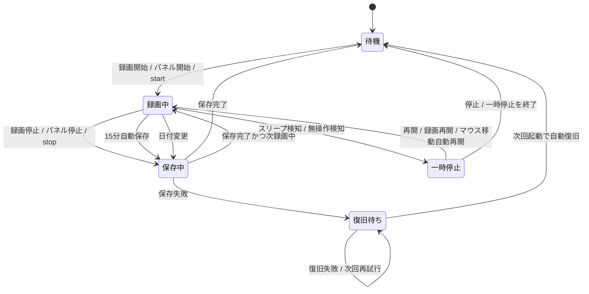

# VisDev Recorder

Macの画面を1FPSで軽く記録するメニューバー常駐アプリです。音声なし、低めの解像度、日別MP4への追記、月別ログ保存に寄せています。

## 最短インストール

配布PKGがある場合は、`OneFPSRecorder-1.0.pkg` を開いてインストールします。アプリは `/Applications/OneFPSRecorder.app` に入り、ログイン時に自動起動します。

PKGではなく配布ZIPを受け取った場合は、展開して `Install-OneFPSRecorder.command` を開きます。

```text
OneFPSRecorder-配布/
  Install-OneFPSRecorder.command
  OneFPSRecorder.app
```

ZIP内のインストーラは `~/Applications/OneFPSRecorder.app` へ配置し、ログイン時に自動起動するように設定します。メニューバーに録画アイコンが出れば起動済みです。

初回だけ macOS の `画面収録` 許可が必要です。聞かれたら `OneFPSRecorder` を許可し、macOSが求めた場合はアプリを開き直してください。Developer IDで署名した同じBundle IDの配布版を使い続ける限り、通常は毎回聞かれません。

## GitHubから使う

署名済みPKGがまだ無い場合でも、GitHubからローカルビルドして使えます。初回だけXcode Command Line Toolsが必要です。

```zsh
git clone https://github.com/Saisei2004/visdev_rec.git
cd visdev_rec
./install.sh
```

`swift` が見つからない場合は、表示に従って以下を実行してから、もう一度 `./install.sh` を実行します。

```zsh
xcode-select --install
```

この方法では利用者のMac上でアプリをビルドして `~/Applications/OneFPSRecorder.app` に入れます。正式なDeveloper ID署名版ではないため、macOSの許可確認が署名済み配布版より多く出ることがあります。

## 開発用メモ

開発ビルドを入れ替える場合、macOS が更新後のアプリを別物として扱い、画面収録の許可を再確認することがあります。通常利用では `~/Applications/OneFPSRecorder.app` だけを使い、別の場所にある同名アプリから起動しないでください。

## 使い方

- メニューバーの録画アイコンから `録画開始` / `録画停止`
- `保存フォルダを開く` で保存先をFinder表示
- 詳細設定で有効にした場合だけ、メニューバーから `業務報告を提出...` を表示
- `設定...` で保存名と基本操作を変更
- `詳細設定...` で表示、月間スコア、自動一時停止、業務報告を変更
- 録画中は小さな前面パネルからも停止可能
- 設定画面の `パネルを今すぐ表示` で、待機中パネルをメイン画面へ呼び戻し
- 設定画面の `アプリを完全終了` で、常駐アプリを終了
- 停止後の保存処理中でも、次の `録画開始` が可能

## 保存先

```text
~/Movies/1FPS録画/YYYY-MM/MMDD/MMDD_保存名.mp4
~/Movies/1FPS録画/YYYY-MM/MMDD/録画区間ログ-YYYY-MM-DD.txt
~/Movies/1FPS録画/YYYY-MM/日別合計作業時間-YYYY-MM.txt
~/Movies/1FPS録画/YYYY-MM/月間スコア-YYYY-MM.txt
~/Movies/1FPS録画/YYYY-MM/業務報告-YYYY-MM.docx
~/Movies/1FPS録画/YYYY-MM/業務報告データ-YYYY-MM.json
~/Movies/1FPS録画/YYYY-MM/提出/MMDD/MMDD_保存名.mp4
```

例:

```text
~/Movies/1FPS録画/2026-06/0616/0616_録画.mp4
```

同じ日の録画は1つのMP4へ後ろに追記されます。統合済みの一時動画は自動で削除します。
保存処理は裏で順番に実行されるため、保存が終わる前に次の録画を始めても同じ日のMP4へ後ろに追記されます。
日別合計と月間スコアは、録画区間ログから毎回再生成します。
月間スコアはアプリ起動、録画開始、録画中の約1分ごと、保存完了時、設定保存時に更新します。

## 業務報告

詳細設定で `メニューバーに業務報告を表示する` をONにすると、メニューバーの `業務報告を提出...` から日付ごとの報告を作成できます。

- 日付を指定すると、その日の動画を `YYYY-MM/提出/MMDD/` へコピー
- 月ごとの `業務報告-YYYY-MM.docx` に、指定日のページを追加または上書き
- 報告内容は `業務報告データ-YYYY-MM.json` にも保存され、DOCXはそこから再生成
- 業務時間は録画区間ログから計算し、切り捨て分単位で `7h 9m` のように記録
- Drive認証済みでDriveフォルダを設定している場合は、提出動画をアップロードし、Drive上の `報告書（7月分）` のような月別Googleドキュメントへページを追加
- 対象月のGoogleドキュメントがDriveフォルダに無い場合は、報告書テンプレートから新規作成
- 業務動画リンク欄には、アップロードした動画のDriveリンクを自動で記録
- 提出先Driveフォルダは提出後に自動で開きます
- 提出画面の初期値は設定の `業務報告初期値...` から変更できます
- 報告書テンプレートは標準で `~/Downloads/報告書（6月分）.docx` を使います。これは新しい月別報告書を作るための雛形です。別名や別フォルダに置く場合は設定で変更します

Drive連携を使う場合は、設定の `業務報告初期値...` に以下を入れます。

- `報告書Driveフォルダ`: 月別Googleドキュメント `報告書（n月分）` を保存するDriveフォルダURL
- `動画Driveフォルダ`: 提出動画をアップロードするDriveフォルダURL
- `報告書テンプレート`: ローカルに置いた報告書テンプレートDOCXのパス

`報告書Driveフォルダ` に貼るのはGoogleドキュメント本体のURLではなく、親フォルダのURLです。`動画Driveフォルダ` が空の場合は、報告書Driveフォルダへ動画をアップロードします。設定画面と業務報告画面では `Cmd+V` / `Cmd+C` / `Cmd+A` などの標準編集ショートカットを使えます。

CLIから同じ提出処理を確認する場合:

```zsh
~/Applications/OneFPSRecorder.app/Contents/MacOS/OneFPSRecorder --submit-report-date 2026-06-20 "業務内容" "次回Task"
```

## 設定

基本設定:

- `保存名`: ファイル名の `MMDD_保存名.mp4` の保存名部分。ファイル名に使えない文字は `-` に置換し、最大48文字に収めます
- `録画開始/停止`: 設定画面から録画を開始または停止
- `パネルを今すぐ表示`: 録画中パネル設定をONにして、待機中パネルをメイン画面へ表示
- `アプリを完全終了`: ログイン時の自動起動設定は残したまま、今動いている常駐アプリを終了
- `詳細設定...`: 表示、月間スコア、自動一時停止、業務報告を変更

詳細設定:

- `録画中パネルを表示する`: 赤い録画中パネルの表示切り替え
- `一時停止パネルを表示する`: スリープや無操作で一時停止したときのパネル表示切り替え
- `メニューバーアイコンを表示する`: OFFにするとメニューバーから消えます。OFF時は録画中パネル、またはアプリを開いた設定画面から開始/停止します
- `メニューバーに時間を表示する`: ONにすると録画中だけ録画時間をアイコン横に表示。OFFでは時間を表示しません
- `メニューバーにスコアを表示する`: ONにすると録画中だけ月間スコアをアイコン横に表示。OFFではスコアを表示しません
- `メニューバーに業務報告を表示する`: ONにした時だけ、メニューバーに `業務報告を提出...` を表示
- `業務報告初期値...`: 詳細設定から開き、提出画面で最初に入る担当者、業務プラン、業務内容、次回Task、状態、メッセージ、報告書Driveフォルダ、動画Driveフォルダ、報告書テンプレートを変更
- `月間スコアを表示する`: 月内の録画時間から算出した金額を表示
- `係数`: 1時間あたりのスコア。標準は `2000`
- `月末ライン`: 月内の目標スコア。標準は `100000`
- `目標達成時に光らせる`: 月間スコアが月末ライン以上になると録画中パネルが発光
- `スリープ時に一時停止する`: Macがスリープへ入る前に録画区間を保存し、復帰後に再開
- `マウス無操作で一時停止する`: 指定分数以上カーソルが動かない場合に一時停止し、パネルの `再開` で録画に戻ります
- `マウスが動いたら自動再開する`: マウス無操作で一時停止したあと、カーソル移動を検知したら自動で録画に戻ります

初回セットアップ:

- このバージョン以降を初めて起動した時だけ、初期設定画面を表示します
- 初期設定画面では保存名、画面収録の許可、使う機能、表示方法を確認します
- 初期設定が完了すると `initialSetupCompleted.v1` が保存され、設定データを消さない限り次回以降は通常設定画面だけになります
- スコア計算、業務報告、自動一時停止は標準では使いません。必要な人だけONにします
- 表示方法は `パネルのみ` / `メニューバーのみ` / `パネルとメニューバー` / `設定画面だけで操作` から選べます
- どの表示方法でも、アプリを開けば設定画面から開始・停止できます


## 仕様

- 1秒1コマ
- MP4 / H.264
- 音声なし
- 出力解像度: `960x600`
- 複数モニター時はマウスカーソルがある画面を録画
- 約15分ごとに自動保存して一時フレームを削除
- 停止後の保存中も次の録画を開始可能
- 配布版はアプリ内に同梱した `ffmpeg` / `ffprobe` を使用。開発インストールでは同梱が無い場合だけ `~/.local/bin` にフォールバック
- 区間時間は開始/終了の壁時計差ではなく、実際に撮れたフレーム時刻を基準に記録
- 日付が変わった場合は次の撮影前に区間を分け、月別ディレクトリと日別MP4に同期
- 起動時に録画区間ログと日別MP4を照合し、ズレがあればMP4全体をリタイミングして1FPSへ正規化
- 各録画区間にID付きメタデータを残し、復旧時の二重追記を防止
- 保存途中で終了した場合も、一時フレームが残っていれば次回起動時に自動復旧
- 動画差し替え中に強制終了しても、残った一時動画やバックアップを起動時に整理
- 復旧できた件数、または復旧できなかった件数は次回起動時に通知し、ログにも記録

## 状態遷移

録画操作は、UMLの状態機械として次のように扱います。



| 現在状態 | 操作 | 次状態 | 挙動 |
| --- | --- | --- | --- |
| 待機 | メニューバー `録画開始` | 録画中 | 新しい一時フレームフォルダを作り、1FPS撮影を開始 |
| 待機 | 設定画面 `録画開始/停止` | 録画中 | メニューバーが非表示でも同じ開始処理 |
| 待機 | 待機パネル `開始` | 録画中 | メニューバー非表示時の主操作 |
| 録画中 | メニューバー `録画停止` | 保存中 | 現在区間を切り離し、日別MP4へ追記 |
| 録画中 | 録画中パネル `停止` | 保存中 | メニューバー停止と同じ |
| 録画中 | 設定画面 `録画開始/停止` | 保存中 | 設定画面から停止して保存 |
| 録画中 | 15分自動保存 | 録画中 + 保存中 | 新しい区間で撮影を続け、古い区間を裏で保存 |
| 録画中 | 日付変更 | 録画中 + 保存中 | 日別ディレクトリを切り替え、前日分を保存 |
| 録画中 | スリープ検知 | 一時停止 | 区間を保存し、復帰後は再開待ち |
| 録画中 | マウス無操作検知 | 一時停止 | 区間を保存し、操作再開後も勝手に録画再開しない |
| 一時停止 | パネル `再開` | 録画中 | 新しい区間として録画を再開 |
| 一時停止 | パネル `停止` | 待機 | 再開せず、待機状態へ戻る |
| 一時停止 | メニューバー `録画再開` | 録画中 | 一時停止パネルを非表示にしていても再開できる |
| 一時停止 | メニューバー `一時停止を終了` | 待機 | 一時停止パネルを非表示にしていても待機へ戻れる |
| 一時停止 | マウス移動検知 + `マウスが動いたら自動再開する` ON | 録画中 | マウス無操作一時停止から自動で新しい区間を開始 |
| 一時停止 | マウス移動検知 + `マウスが動いたら自動再開する` OFF | 一時停止 | 表示だけ更新し、ユーザーが `再開` または `停止` を選ぶ |
| 保存中 | `録画開始` | 録画中 + 保存中 | 保存中でも次の録画を開始可能 |
| 保存中 | 保存成功 | 待機または録画中 | フレームフォルダを削除し、ログと日別合計を同期 |
| 保存中 | 保存失敗 | 復旧待ち | 一時フレームを消さずに残し、次回起動時に再試行 |
| 復旧待ち | アプリ起動 | 待機 | `.frames-*` から動画とログを自動復旧 |
| 任意 | `パネルを今すぐ表示` | 状態維持 | 現在状態のまま操作パネルを前面へ表示 |
| 任意 | `アプリを完全終了` | 終了 | 録画中なら停止保存を開始してから終了処理 |

## インストーラが行うこと

- Swiftでアプリをビルド
- ffmpegがなければ準備
  - Homebrewがある場合: `brew install ffmpeg`
  - Homebrewがない場合: Mac用ffmpegバイナリを `~/.local/bin` へ取得
- アプリ内に `ffmpeg` / `ffprobe` を同梱
- `~/Applications/OneFPSRecorder.app` へ配置
- LaunchAgentを作成してログイン時自動起動

## 配布ZIPの作成

一般配布用のZIPを作るMacには、Apple Developer Programの `Developer ID Application` 証明書が必要です。証明書が無い状態では、一般配布向けビルドは止まります。

```zsh
./scripts/build_distribution.sh
```

成功すると `dist/OneFPSRecorder-1.0.zip` が作成されます。ZIPには `OneFPSRecorder.app` と `Install-OneFPSRecorder.command` が入り、受け取った人はSwift、Homebrew、ffmpegを準備せずにインストールできます。

`Developer ID Installer` 証明書も入っているMacでは、あわせて `dist/OneFPSRecorder-1.0.pkg` も作成します。一般配布ではPKGを渡すのが最短です。

Developer ID証明書がない場合でも `ONEFPS_ALLOW_UNSIGNED=1 ./scripts/build_distribution.sh` で検証用ZIPは作れます。ただしGatekeeperで拒否されるため、他人へ配る正式版には使いません。

公証まで行う場合は、先にnotarytoolのプロファイルを作成します。

```zsh
xcrun notarytool store-credentials onefps-notary --apple-id APPLE_ID --team-id TEAM_ID --password APP_SPECIFIC_PASSWORD
ONEFPS_NOTARY_PROFILE=onefps-notary ./scripts/build_distribution.sh
```

署名確認:

```zsh
codesign --verify --deep --strict --verbose=2 dist/OneFPSRecorder-配布/OneFPSRecorder.app
spctl -a -vv --type execute dist/OneFPSRecorder-配布/OneFPSRecorder.app
```

## 確認

```zsh
ps -axo pid,%mem,rss,args | rg OneFPSRecorder
tail -n 50 ~/Library/Logs/1FPS録画.log
```

## アンインストール

```zsh
launchctl unload ~/Library/LaunchAgents/local.codex.OneFPSRecorder.plist 2>/dev/null || true
rm -f ~/Library/LaunchAgents/local.codex.OneFPSRecorder.plist
rm -rf ~/Applications/OneFPSRecorder.app
```

録画済みファイルを消す場合だけ、以下も実行します。

```zsh
rm -rf ~/Movies/1FPS録画
```

## 開発作業での使い方

このアプリはリポジトリの外に常駐します。アプリ本体は `~/Applications/OneFPSRecorder.app`、録画データは `~/Movies/1FPS録画` に保存されるため、作業ブランチや worktree を切り替えても録画環境はそのまま使えます。

### 作業開始

1. メニューバーの `1FPS` を開く
2. `録画開始` を押す
3. 必要なら録画中パネルを邪魔にならない位置へ移動する

### 作業終了

1. 録画中パネルの `停止`、またはメニューバーの `録画停止` を押す
2. `保存フォルダを開く` で当日のMP4とログを確認する

### 振り返り

- 作業の流れを見る: `YYYY-MM/MMDD/MMDD_保存名.mp4`
- 開始/終了の区間を見る: `YYYY-MM/MMDD/録画区間ログ-YYYY-MM-DD.txt`
- その日の合計作業時間を見る: `日別合計作業時間-YYYY-MM.txt`
- 月内の合計時間と月間スコアを見る: `月間スコア-YYYY-MM.txt`
- 月間スコアを0から始め直す: 設定の `今月を初期化` を押す。録画動画、録画区間ログ、日別合計は消えません。

ログ秒数とMP4フレーム数が一致しているか確認する場合:

```bash
python3 scripts/verify-recordings.py
```

PRやレビューの前に作業内容を見返す場合は、当日のMP4をざっと再生し、必要な時間帯だけ確認します。1FPSなので長時間でも軽く、細かい入力内容より「どの画面で何をしていたか」を追いやすい設計です。

### ブランチ切り替え時

特別な操作は不要です。録画中にブランチを切り替えても、そのまま同じ日のMP4へ追記されます。録画を区切りたい場合だけ、一度停止してから次の作業で録画開始してください。

### 画面が多い場合

1秒ごとにマウスカーソルがある画面を録画します。記録したい画面にカーソルを置いて作業してください。

### 設定のおすすめ

- 保存名: 自分の名前や作業名
- 録画中パネル: ON
- 月間スコア: 必要な人だけON
- 月末ライン: 目標金額。標準は `100000`
